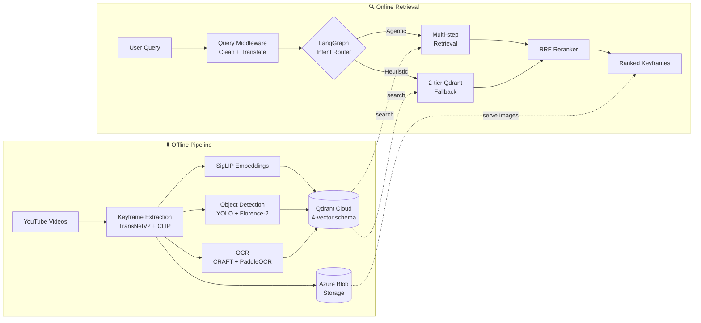

<div align="center">

# 🔍 NLP4B — Multimodal Video Retrieval System

**Search any video by what you see. Type a query, get the exact keyframe.**

[](#)
[](#license)
[](#prerequisites)
[](#deployment)

<br/>


</div>

---

An **end-to-end multimodal video retrieval pipeline** that turns natural-language queries (Vietnamese or English) into precise keyframe results. Built for the **CSC15012 — Applications of NLP in Industry** course at HCMUS.

> Given a text query like *"người mặc áo đỏ đang nấu ăn"*, the system searches across **visual embeddings**, **semantic text**, **sparse lexical matches**, and **object metadata** to return the most relevant video keyframes — ranked by a cross-source **Reciprocal Rank Fusion (RRF)** reranker.

## 📸 Demo

<!-- Replace with actual screenshots or GIF -->
<div align="center">

| Query Input | Retrieved Keyframes |
|:-----------:|:-------------------:|
|  |  |

</div>

## ✨ Key Features

- 🎯 **Multi-vector retrieval** — 4-signal search (SigLIP visual, BGE-M3 semantic, BM25 sparse, object metadata) with True RRF reranking
- 🤖 **Agentic pipeline** — LangGraph-powered intent classification that dynamically routes queries to the optimal retrieval strategy
- 🌐 **Bilingual support** — automatic Vietnamese ↔ English translation with query cleaning middleware
- 🎬 **Smart keyframe extraction** — TransNetV2 shot detection + CLIP-guided K-Means clustering (LMSKE algorithm)
- 🔎 **Object-aware search** — YOLO + Florence-2 hybrid detection and CRAFT + PaddleOCR text recognition on every keyframe
- 🐳 **Dockerized embedding service** — CPU-only deployment on Azure VM serving BGE-M3, BM25, and SigLIP via REST API
- ⚡ **Production-ready API** — FastAPI backend with health checks, structured logging, and Qdrant Cloud integration

## 🏗️ Architecture

### Tech Stack

| Layer | Technology |
|-------|-----------|
| **Frontend** | Streamlit |
| **Backend API** | FastAPI, LangGraph, LangChain |
| **Embeddings** | SigLIP (1152d), BGE-M3 (1024d), BM25 (sparse) |
| **Object Detection** | YOLOv8, Florence-2 |
| **OCR** | CRAFT, PaddleOCR |
| **Vector Database** | Qdrant Cloud |
| **LLM** | Google Gemini (configurable) |
| **Storage** | Azure Blob Storage |
| **Deployment** | Docker, Azure VM |

### Data Flow



## 🚀 Getting Started

### Prerequisites

| Requirement | Version | Purpose |
|------------|---------|---------|
| **Python** | 3.11+ | Runtime |
| **FFmpeg** | latest | Video processing & ffprobe metadata |
| **Docker** | 20+ | Embedding service deployment |
| **Git** | latest | Version control |

### Installation

```bash
# 1. Clone the repository
git clone https://github.com/CallmeAndree/NLP4B.git
cd NLP4B

# 2. Set up environment variables
cp configs/.env.example backend/.env
# Edit backend/.env — fill in QDRANT_URL, QDRANT_API_KEY, GEMINI_API_KEY, EMBEDDING_API_BASE_URL

# 3. Install dependencies (pick one)
pip install -r requirements.txt                              # All modules
pip install -r backend/requirements.txt                      # Backend only
pip install -r data-processing/requirements.txt              # Pipeline only
pip install -r frontend/requirements.txt                     # Frontend only
```

> **PyTorch note:** Install separately for CPU/GPU flexibility:
> ```bash
> pip install torch torchvision --extra-index-url https://download.pytorch.org/whl/cpu      # CPU
> pip install torch torchvision --extra-index-url https://download.pytorch.org/whl/cu121     # CUDA 12.1
> ```

## 📖 Usage

### Quick Start — Run the full system

```bash
# Terminal 1: Embedding service (Docker)
cd azure-ai-provider && docker compose up -d --build

# Terminal 2: Backend API
cd backend && uvicorn api:app --host 0.0.0.0 --port 8000 --reload

# Terminal 3: Frontend UI
cd frontend && streamlit run app.py
```

Open **http://localhost:8501** → type a query → get ranked keyframes.

### API Example

```bash
# Search for keyframes matching a natural language query
curl -X POST http://localhost:8000/search \
  -H "Content-Type: application/json" \
  -d '{"query": "a person in red shirt cooking", "top_k": 10}'
```

### Data Processing Pipeline

```bash
cd data-processing

# Download videos → Extract keyframes → Generate embeddings → Detect objects → Index
python -m src.download.main --input-excel templates/link_videos_template.xlsx --output-root ./output
python src/keyframe_extraction/LMSKE.py --video ./output/videos/<video_id>.mp4 --output_dir ./output/keyframes
python src/embedding/embedding.py --input_dir ./output/keyframes/<video_id> --output_dir ./output/embeddings
python src/object_detection/object_detection.py -i ./output/keyframes/<video_id> -o ./output/detections
python -m src.qdrant.upsert --input-dir ./output
```

See [data-processing/README.md](data-processing/README.md) for detailed walkthroughs and notebooks.

## 📁 Repository Structure

```
NLP4B/
├── backend/                      # Retrieval API (FastAPI + LangGraph)
│   ├── src/
│   │   ├── config.py             # Unified env config
│   │   ├── middlewares/          # Query cleaning + translation
│   │   ├── controllers/         # Orchestration, cross-source RRF rerank
│   │   └── services/
│   │       ├── agentic_retrieve/ # LangGraph intent-aware pipeline
│   │       └── heuristic_retrieve/ # 2-tier Qdrant fallback + True RRF
│   ├── test/                     # Benchmarks and demo scripts
│   ├── api.py                    # Entry point (/health + /search)
│   └── requirements.txt
│
├── data-processing/              # Offline artifact generation pipeline
│   ├── src/                      # All processing modules
│   ├── data/                     # Downloaded raw data
│   ├── test/                     # Unit tests
│   ├── notebook/                 # Step-by-step processing notebooks
│   └── requirements.txt
│
├── frontend/                     # Streamlit demo UI ("LookUp.ai")
│   ├── app.py                    # Entry point
│   ├── components/               # Reusable UI components
│   └── requirements.txt
│
├── azure-ai-provider/            # Embedding-as-a-Service (Docker)
│   ├── embedding_service/        # Dockerfile + FastAPI app
│   ├── docker-compose.yml
│   └── DEPLOY.md
│
├── configs/                      # Configuration templates
├── models/                       # Model documentation (weights downloaded at runtime)
├── tests/                        # Test index (per-module tests)
├── docs/                         # Architecture and contract docs
├── requirements.txt              # Consolidated dependencies
└── README.md
```

## 🚢 Deployment

| Component | Technology | Target | Details |
|-----------|-----------|--------|---------|
| **Embedding Service** | FastAPI + Docker | Azure VM `Standard_B4as_v2` (CPU) | [DEPLOY.md](azure-ai-provider/DEPLOY.md) |
| **Backend API** | FastAPI | Local / Cloud VM | `uvicorn api:app` |
| **Frontend** | Streamlit | Local / Streamlit Cloud | `streamlit run app.py` |
| **Vector DB** | Qdrant | Qdrant Cloud (managed) | [Schema contract](docs/contracts/qdrant-collection-schema.md) |
| **Blob Storage** | Azure Blob | Azure Storage Account | Keyframes + embeddings |

```bash
# One-command deployment for the embedding service
cd azure-ai-provider && docker compose up -d --build
curl http://localhost:8000/health   # Verify: {"status": "healthy"}
```

## 🗺️ Roadmap

- [x] Video ingestion pipeline (YouTube download + metadata)
- [x] Keyframe extraction (TransNetV2 + CLIP-guided clustering)
- [x] Multi-model embedding (SigLIP + BGE-M3 + BM25)
- [x] Object detection & OCR annotation
- [x] Qdrant Cloud indexing (4-vector schema)
- [x] Agentic retrieval with LangGraph intent routing
- [x] Heuristic retrieval with True RRF reranking
- [x] Dockerized embedding service on Azure VM
- [x] Streamlit demo UI ("LookUp.ai")
- [x] Azure Blob Storage migration
- [ ] GPU-accelerated embedding service
- [ ] Batch video processing with job queue
- [ ] User feedback loop for retrieval quality
- [ ] Temporal search (query across video timeline)

## 🤝 Contributing

Contributions are welcome! Follow these steps:

```bash
# 1. Fork the repository
# 2. Create a feature branch
git checkout -b feat/your-feature-name

# 3. Make your changes and commit
git commit -m "feat: add your feature description"

# 4. Push to your fork
git push origin feat/your-feature-name

# 5. Open a Pull Request on GitHub
```

Please follow existing code style and include tests where applicable.

## 📚 Documentation

| Document | Purpose |
|----------|---------|
| [data-processing/README.md](data-processing/README.md) | Offline pipeline: submodules, CLI usage, artifacts |
| [backend/README.md](backend/README.md) | Backend API: endpoints, request flow, tech debt |
| [azure-ai-provider/DEPLOY.md](azure-ai-provider/DEPLOY.md) | Embedding service Azure VM deployment |
| [docs/architecture.md](docs/architecture.md) | System architecture and pipeline flow |
| [docs/contracts/qdrant-collection-schema.md](docs/contracts/qdrant-collection-schema.md) | Qdrant collection schema contract |

## 📝 License

This project is licensed under the **MIT License** — see the [LICENSE](LICENSE) file for details.

---

<div align="center">

**Built with ❤️ for CSC15012 — Applications of NLP in Industry @ HCMUS**

</div>
